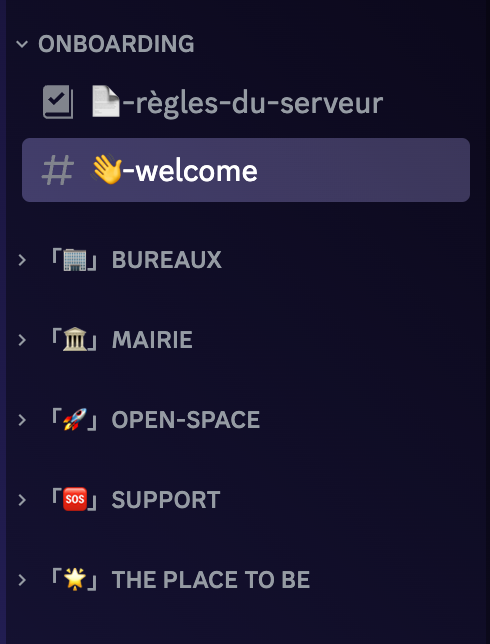
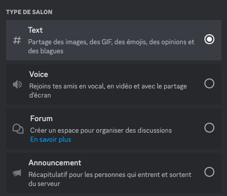
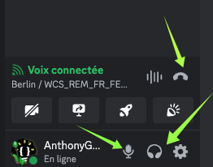
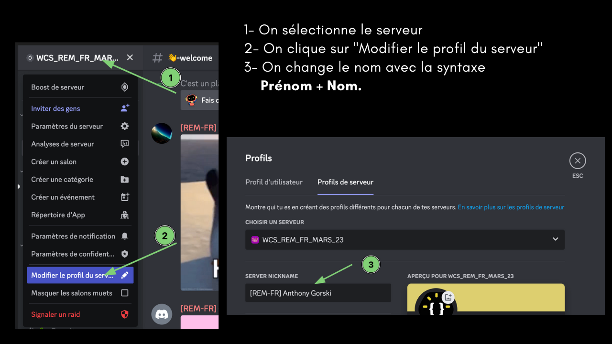

# Discord, notre campus à nous, les remotes ! 🏫

## 🤔 Comment fonctionne discord ?

Lorsque vous pénétrez pour la première fois dans notre sanctuaire Discord, vous pourriez vous sentir comme dans une zone déserte de code... enfin, pour l'instant 😅 ! Pas de panique, c'est tout à fait normal. Une fois connecté, vous devez sélectionner votre formateur 🧑‍🏫.

## 💻 L'interface

Vous avez maintenant accès aux canaux (comme des salles secrètes) de notre monde Discord, mais suivez-moi pour une visite digne d'un développeur cherchant des bugs !

## 🔍 Les détails

Comme un détective scrutant un fichier de code, voici les catégories du Discord.

-   **Bureaux** 🏢:
    -   Ici, nos formateurs ont des bureaux avec vue sur la mer, l'océan ou même la montagne 🏞️.
-   **Mairie** 🏛️:
    -   C'est là que les annonces importantes sont faites pour tout le monde. Imaginez-le comme une assemblée générale, mais avec moins de cravates.
-   **Open Space** 🌌:
    -   C'est notre espace vocal détente. Il y a même un coin "AFK" pour ceux qui s'évaporent temporairement. Et pour les aventuriers, "Créer un salon vocal" vous emmène dans une quête vocale éphémère !
-   **Support** 🆘:
    -   Ici, c'est où les codeurs super-héros se rassemblent. L'entraide, c'est notre super-pouvoir.
-   **The place to be** 🌟:
    -   Imaginez-le comme la taverne des développeurs : mèmes, musique, discussions sur le sport, les animes et plus encore.

## 💬 Les salons

Regardez ces petits badges à côté des canaux, ce ne sont pas que des icônes, ils ont une signification !

-   #️⃣
    -   Le dièse (#) indique un salon de discussion texte classique. Comme un défilement infini de code, les messages apparaissent en cascade, comme des lignes de code bien indentées.
-   🔊
    -   Un microphone, le saint graal des salons vocaux ! Parlez, discutez, partagez - pas de limite, c'est la fête de la voix.
-   💬
    -   Une bulle de discussion, un peu comme un forum. Ici, vous organisez vos discussions en dossiers bien rangés. Un peu comme ranger son code, mais sans le stress.

## 📞 Allô, c'est pour un appel

Les salons vocaux, comme son nom l'indique, sont des salons où vous pouvez parler. Mais comment ça marche ? C'est simple, il suffit de cliquer sur le salon vocal de votre choix et vous serez automatiquement connecté. Vous pouvez même créer votre propre salon vocal en cliquant sur le bouton "Créer un salon vocal" en haut de la liste des salons vocaux.
Celui-ci créera un salon vocal temporaire, qui disparaîtra lorsque vous le quitterez. C'est comme un salon vocal jetable, mais sans le plastique.

-   Vous pouvez raccrocher en cliquant sur le bouton à droite avec le téléphone.
-   Vous pouvez couper votre micro en cliquant sur le bouton du microphone.
-   Si vous cliquez sur le casque, vous n'entendrez plus rien, et on ne vous entendra plus.

⚠️ Quand vous parlez et que personne vous répond, ne soyez pas vexé, juste, regardé si par hasard vous n'avez pas coupé votre micro & casque. ⚠️

## 👀 Vos noms

Concernant le nom sur discord, il y a une syntaxe à respecter.

- Prénom + Nom
  - ex: `John Doe`

## 📝 Votre mission, si vous l'acceptez

N'oubliez pas : Discord n'est pas une option, c'est votre nouveau monde ! Pendant les heures de formation, vous DEVEZ être sur Discord, dans un salon vocal (que ce soit le vôtre ou un déjà existant). Si un formateur vous appelle et que vous ne répondez pas, préparez-vous à être marqué absent, comme si vous aviez planté votre tente dans un monde virtuel.
Alors, soyez là, soyez intrépide et plongez dans l'univers numérique du développement comme un véritable héro du code ! 🦸‍♂️🚀
